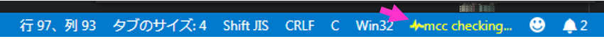

# Multi Code Checker for C Language

## 機能


C言語用のコードチェッカーです。
ファイルのセーブ時、コマンドの実行時にそれぞれ設定したコンパイラによるコードチェックを実施できます。

チェックに使用するコンパイラは予めインストールしておく必要があります。

## 要求

デフォルト状態でコードチェックを実施する場合は、gccコンパイラをインストールしてください。

## コマンド
以下のコマンドで'mcc.checkers.onCommand'(後述)に設定したコンパイラによるコードチェックを実行します。
```
mcc.check
または
Multi Code Chekcer for C Languge: Check Code
```


## 設定

コードのセーブ時、コマンド実行時に使用するコンパイラの設定が必要です。

* `mcc.checkers.onSaved`: セーブ時のチェックに使用するコンパイラ設定のリスト
* `mcc.checkers.onCommand`: コマンド実行時に使用するコンパイラ設定のリスト

コンパイラ設定として以下の情報を設定してください。

```typescript
{
    compileCommand: string; // 使用するコンパイルコマンド
    maxNumberOfProblems: number; // 表示するエラー、警告の上限数
    compileOptions: string[]; // コンパイルオプションのリスト
    includeOptionPrefix: string; // インクルード用オプション
    includePath: {
        absolute: string[]; // インクルードパス（絶対パス）
        relative: string[]; // インクルードパス(ワークスペースルートからの相対パス)
    }
    diagDelimiter: string; // コンパイルエラーメッセージの区切り文字
    parse: {
        encoding: string; // コンパイラの出力メッセージのエンコーディング
        diagInfoPattern: string; // コンパイラの出力メッセージ解析用パターン（正規表現）
        index: {
            file_name: number; // 解析用パターン内で指定したグループのファイル名に対応するインデックス番号
            line_pos: number; // 解析用パターン内で指定したグループの行番号に対応するインデックス番号
            char_pos: number; // 解析用パターン内で指定したグループの列番号に対応するインデックス番号
            severity: number; // 解析用パターン内で指定したグループの検出種別に対応するインデックス番号
        }
        severityIdentifier: {
            error: string; // 検出種別のうち、エラーを表す文字列
            warning: string; // 検出種別のうち、警告を表す文字列
            information: string; // 検出種別のうち、インフォメーションを表す文字列
            hint: string; // 検出種別のうち、ヒントを表す文字列
        }
    }
}
```

## 設定例
```json
"mcc.checkers": {
	"onSaved": [{	
	    "maxNumberOfProblems": 100,
	    "compileCommand": "gcc",
	    "includeOptionPrefix": "-I",
	    "includePath" : {
		    "absolute": [],
		    "relative": [] 
	    },
	    "compileOptions": [
			"-fsyntax-only",
			"-Wall",
			"-fdiagnostics-parseable-fixits"
	    ],
	    "diagDelimiter": "^.+:[0-9]+:[0-9]+:",
	    "parse": {
		    "encoding": "utf-8",
		    "diagInfoPattern": "^(.+):([0-9]+):([0-9]+):\\s*(.+):.*",
		    "index": {
			    "file_name": 1,
			    "line_pos": 2,
			    "char_pos": 3,
			    "severity": 4
		    },
		    "severityIdentifier": {
			    "error": "error",
			    "warning": "warning",
			    "information":"information",
			    "hint":"hint"
		    }
	    } 
	}],
                    
    "onCommand": [{	
		"maxNumberOfProblems": 100,
		"compileCommand": "gcc",
		"includeOptionPrefix": "-I",
		"includePath" : {
		    "absolute": [],
		    "relative": [] 
		},
		"compileOptions": [
			"-fsyntax-only",
			"-Wall",
			"-fdiagnostics-parseable-fixits"
		],
		"diagDelimiter": "^.+:[0-9]+:[0-9]+:",
		"parse": {
			"encoding": "utf-8",
			"diagInfoPattern": "^(.+):([0-9]+):([0-9]+):\\s*(.+):.*",
			"index": {
				"file_name": 1,
				"line_pos": 2,
				"char_pos": 3,
				"severity": 4
			},
			"severityIdentifier": {
				"error": "error",
				"warning": "warning",
				"information":"information",
				"hint":"hint"
			}
		} 
	}]
}
```

## 既知の問題

なし

## リリースノート

### 0.0.1

プロトタイプ初版リリース

### 0.0.2

軽微な修正

- コードのチェック中，ステータスバーにアイコンを表示するよう変更

	

- ファイルを閉じた際，当該ファイルのチェック結果を"問題"パネルのリストから削除するように変更


